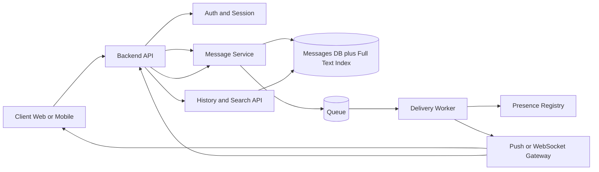
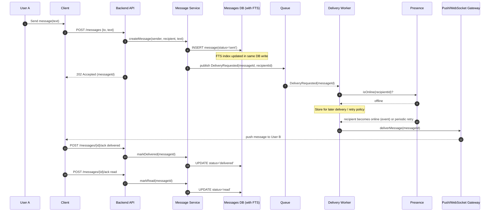
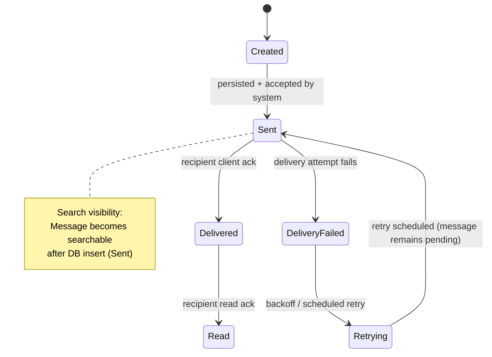

#  Laboratory Work 1  Designing a Messaging System
## Variant 9  Message Search & History (DB-based search)

---

## 0) Goal
Design a minimal messenger system that supports:
- one-to-one messaging
- asynchronous delivery (recipient may be offline)
- message status lifecycle: `sent` / `delivered` / `read`
- **Variant 9 add-ons:** search through message history + pagination

---

## 1) Context & Requirements

### 1.1 Base functional requirements
1. User A can send a message to User B.
2. Each message has a lifecycle (status changes over time).
3. The system must store messages, deliver them asynchronously, and update delivery status.
4. Recipient may be online or offline.

### 1.2 Variant 9  additional requirements
1. Users can search through their message history.
2. History and search results support pagination.

### 1.3 Non-functional expectations (minimal but explicit)
- Privacy: a user can only search messages from conversations they are a member of.
- Performance: history listing and search must be efficient for large histories.
- Consistency: new messages should become searchable quickly (preferably immediately).

### 1.4 Assumptions (to keep scope minimal)
- Only 1:1 conversations (no groups).
- Message content is stored server-side (no end-to-end encryption in this variant).
- Search means full-text search by message body (optionally with simple filters like date range).

---

## 2) Part 1  Component Diagram (Variant 9 included)

**Responsibilities (short):**
- **Client:** compose/send messages, display history, run search, send delivery/read acknowledgements.
- **Backend API:** authentication, request validation, exposes endpoints.
- **Message Service:** message creation, status transitions, publishes delivery jobs.
- **Messages DB + Full-Text Index:** source of truth for messages + supports DB-based search.
- **Queue + Delivery Worker:** asynchronous delivery and retries for offline recipients.
- **Presence + Push/WebSocket Gateway:** determines online status and delivers events/messages.
- **History/Search API:** reads from DB with pagination and full-text search.

---

## 3) Part 2  Sequence Diagram
### Scenario: User A sends a message to User B who is offline

**Variant 9 relevance:** messages are written to DB once and become searchable via the DB full-text index.

---

## 4) Part 3  State Diagram
### Object: `Message`

**Notes:**
- Status updates are driven by **client acknowledgements**.
- In 1:1 chats a single status per message is sufficient.

---

## 5) Part 4  ADR (Architecture Decision Record)

# ADR-001: Use Database Full-Text Search for Message Search & History

| Field | Value |
|---|---|
| Status | Accepted |
| Date | 2026-03-03 |
| Decision Makers | Student / Team |
| Technical Area | Data access, Search, Performance |

## Context
We must support **Variant 9**:
- search through message history
- pagination for history and search results

Constraints:
- Minimal system design (no complex infra unless necessary)
- Privacy: users must only see/search messages in conversations they belong to
- Good performance for large histories

## Decision
Use the **primary Messages database** as the source of truth and implement **DB-based full-text search**.

### Indexing strategy
- Store messages in a `messages` table with at least:
  - `message_id` (unique)
  - `conversation_id`
  - `sender_id`, `recipient_id`
  - `created_at`
  - `body`
  - `status`
- Add indexes for efficient history reads:
  - composite index on `(conversation_id, created_at DESC, message_id DESC)`
- Add a full-text index for `body` scoped by `conversation_id`:
  - DB-specific implementation (conceptual): full-text index on searchable representation of `body`

### Pagination strategy
Use **cursor-based pagination** for both history and search results:
- Cursor = `(created_at, message_id)` of the last item on the page
- Sorting = `created_at DESC, message_id DESC`

Why cursor pagination:
- Stable ordering under concurrent inserts
- Better performance than large offsets

### Privacy enforcement
All history/search queries are filtered by access control:
- Resolve `conversation_id`s where the requesting user is a member
- Apply that filter before returning any results

### API (conceptual)
- `GET /conversations/{id}/messages?limit=50&cursor=...`  history page
- `GET /conversations/{id}/search?q=...&limit=50&cursor=...`  search within a conversation

## Alternatives
1. **Dedicated search engine (e.g., Elasticsearch/OpenSearch)**
   - Pros: better relevance ranking, scaling, advanced query features
   - Cons: extra infrastructure + **eventual consistency** between DB and search index

2. **Offset-based pagination**
   - Pros: simplest API (`page=1,2,3`)
   - Cons: slow for deep pages; results can shift when new messages arrive

3. **Client-side search** (download history and search locally)
   - Pros: trivial backend
   - Cons: violates performance/privacy goals; not feasible for large histories

## Consequences
Positive:
- Minimal infrastructure: single DB is enough
- Strong consistency: a committed message is immediately searchable
- Simple operations and fewer failure modes

Negative / trade-offs:
- DB CPU/IO increases due to search workload
- Search features are limited by DB capabilities
- If traffic grows significantly, we may need to evolve to a dedicated search system later
